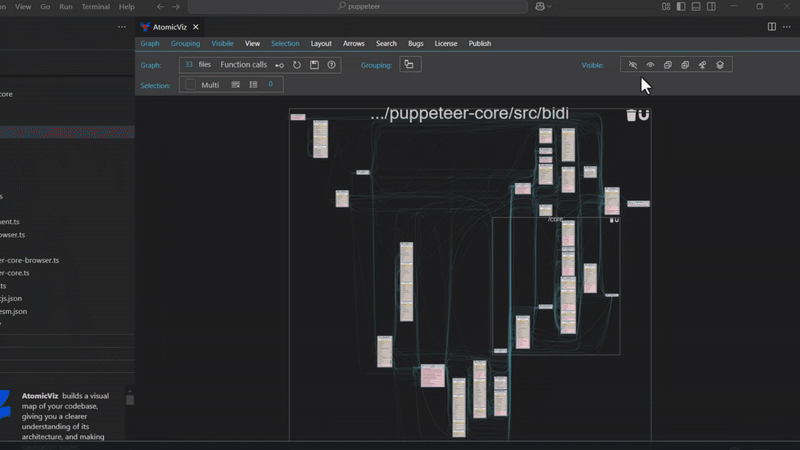
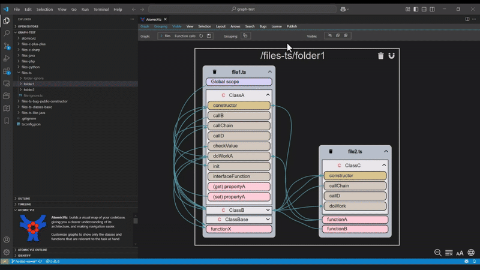
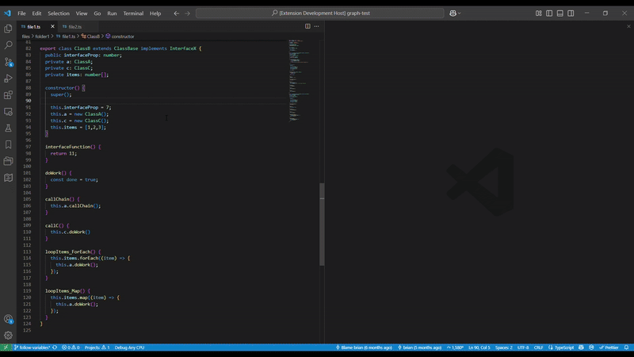

  

# AtomicViz

**AtomicViz** builds a visual map of your codebase, giving you a clearer understanding of its architecture, and making navigation easier.

* Select a set of files to generate an interactive code diagram
* Generate a graph of a function call hierarchy or variable references
* Customize graphs to show only the classes and functions that are relevant to the task at hand
* Use the integrated outline view which mirrors the graph and improves navigation
* Works with Typescript, Javascript, Python, Java, C++, and other major languages

**Video overview**: https://youtu.be/ZsFmE1eRgh4

**Video detail**: https://www.youtube.com/watch?v=ZsDd4Q4E81I

**Video tutorials**: https://atomicviz.web.app/page-tutorial

# NEW Features (2025-06-11)

* Improved set of tools in the **Visibility** toolbar to handle complicated graphs
    * The menu to hide items now includes "Internal class methods" and "Internal file functions" to quickly simplify the graph
    * The menu to show items now includes options to quickly show all items of a granularity
    * **Focus mode** now allows you to show items connected to the selection to a chosen depth
    * **Level Of Detail mode** allows you to quickly simply the graph to a chosen level of detail
    * Video (visibility menu):  https://youtu.be/QbO9B-ZIJB8
    * Video (focus mode):  https://youtu.be/H6Mmt_8yuf4
    * Video (level of detail mode):  https://youtu.be/q7MTFmctMc0
* Added button in **Graph** toolbar to toggle visibility of interfaces for a 'files' graph
* Added button in **Arrows** toolbar to control the size of the arrowheads
* Added explorer context menu command to easily add a file to the active graph

# NEW Features (2025-05-27)

* Publish interactive graphs that can be used outside of VS Code and shared with others. This features requires a license.
* To **publish a graph** show the **Publish** toolbar. Provide a name for the graph and click the _**Publish**_ button. Then click the _**Rocket**_ button to open the AtomicViz website where you can manage all of your published graphs.
* To **share a graph** from the AtomicViz webite, show the **Mangage** toolbar and click the _**Link**_ button to get the URL.

# NEW Features (2025-04-23)

* Quickly generate a graph of a function or variable by double-clicking it in the editor to select it
* To **create a graph** of the **focused symbol**, open the Command Palette (Ctrl+Shift+P) and choose the command _**AtomicViz: Create graph of focused symbol**_. Then double-click a function or variable in the editor to create the graph.

# Features

* Create interactive graphs of:
    * Function calls
    * Variable references
    * Class inheritance
    * Interface implementation

* An integrated outline view mirrors the graph

* Interact with the code:
    * Jump to code from the graph or outline
    * The graph and outline follow code editing

* Works for many programming languages

* Customize the graph:
    * Layout graphs by file/folder, by files, with no grouping, or using custom groups
    * Hide unwanted graph items that are not relevant to your focus
    * Collapse graph items to show class dependencies at any level of detail
    * Easily exclude specific files from the graph

* Use FOCUS mode to quickly see the connections to selected graph items to a chosen depth
* Use LEVEL OF DETAIL mode to quickly simply the graph to a chosen level of detail
* Save customized graphs as local AtomicViz files, and then open the AtomicViz file to load the graph
* Show graphs in either the sidebar or code editor area
* Show multiple graphs simultaneously
* Search the graph
* Use the VS Code theme, light or dark
* Configure graph colors
* Export graphs as SVG
* Publish interactive graphs usable outside of VS Code

# Requirements

* Install the language pack for your language

# Paid features

* **AtomicViz** is free with limitations on the number and size of files included in the graph, and on the call-depth when graphing a function call hierarchy. Files in excess of the limits will be shown but will be permanently collapsed.

* You can purchase an **annual license** to remove these limitations for a single machine. Create a simple graph with a few files. In the graph window show the "Atomic" toolbar and then click the smiley face to purchase a license. When developing remotely, the license will be valid only for the remote machine.

* There is currently a hard cap of the number of files allowed, for performance reasons. Contact me if you need to increase this limit.

# How to use it

You can create several types of graphs:

1. **Files graph**: A graph based on a set of selected files which shows function calls, class inheritance, or interface implementation

2. **Function graph**: A graph which shows the call hierarchy of single function to a selected call depth

3. **Focused symbol graph**: A graph which dynamically shows a graph for the function or variable selected in the editor

* To **create a graph** for **selected files**:
  > In the file explorer select the folders or files to include in the graph, right-click and choose _**AtomicViz: Create graph for selected files**_ from the context menu. Choose the command _**AtomicViz: Create graph for selected files, with variables**_ to include variable references.

* To **create a graph** for a **single function** to see its call hierarchy:
  > In the code, position the cursor on a function name, right-click and choose _**AtomicViz: Create graph for function**_ from the context menu. You can change the call depth later using the buttons in the toolbar.

* To **create a graph** of the **focused symbol**:
  > Open the Command Palette (Ctrl+Shift+P) and choose the command _**AtomicViz: Create graph of focused symbol**_. An empty graph will be created. Then double-click a function or variable name in the editor to select it and create the graph.

* To **open an existing** graph file:
  > Click on the AtomicViz file (*.atm) in the file explorer. If the graph file is already open, then right-click on the file in the file explorer and choose _**AtomicViz: Show graph**_ from the context menu.

* To **add a file** to an existing "files" graph:
  > Open the file to add to the graph in the editor. Then right-click on the AtomicViz file in the file explorer and choose _**AtomicViz: Add active editor file to graph**_.  OR
  > Load or create a graph. Then right-click on a file in the file explorer and choose _**AtomicViz: Add file to graph**_.

* To **convert** a "function" graph to a "files" graph:
  > Right-click on the AtomicViz file in the file explorer and choose _**AtomicViz: Convert 'function' graph to 'files' graph**_ from the context menu.

NTOE: Files identified in any **.gitignore** file in the project will be ignored when creating a graph.

# Instructions and Documentation

Detailed usage instructions and troubleshooting tips are at <a href="https://atomicviz.web.app/page-help">AtomicViz online</a>

# Data & Privacy

* Absolutely none of your code or environment data is collected or shared
* The extension runs completely locally except to manage licensing and to send telemetry for extension usage.

# How does it work

* AtomicViz uses the **language server** capabilities of VS Code that are provided for each language. The language server can provide a call hierarchy for any function, so it is possible to build a map of a codebase by interrogating the language server for all the functions in a given scope.

* Graphs are created using **Graphviz**, so the layout is managed by the Graphviz algorithms.

* Transitions during the expansion or collapse of a graph item **try to maintain continuity of position** of the item affected. Generally, the top-right corner of an item should remain in position across a transition.

# Motivation

* Every codebase is a maze of files. The only semantic information at a quick glance are the file and folder names.

* A graphical representation of a code is more informative, and more useful as a tool for navigation if it shows only the files and functions relevant to the task at hand. Then you can easily jump to the sections of code that you are working on, without the need to use bookmarks, search-all-files for a symbol name, or find-all-references for a symbol.

# Keywords

* code architecture diagram
* code diagram
* code graph
* code map
* code navigation
* code visualizer
* code visualization
* dependency graph
* dependency diagram
* function call graph
* function call diagram
* function call hierarchy
* call hierarchy

# Feedback

I would love to hear your feedback and ideas for improvements.
Please report issues in <a href="https://github.com/briandiloreto/AtomicViz">Github</a> or via the **Bugs** toolbar in the extension.
Email any questions of comments to atomicviz11@gmail.com

Thanks!

# Support further development

**AtomicViz** wasn't easy to build. If you find it useful, please consider supporting it.

# License
[Copyright](LICENSE.md) &copy; Brian DiLoreto 2025
