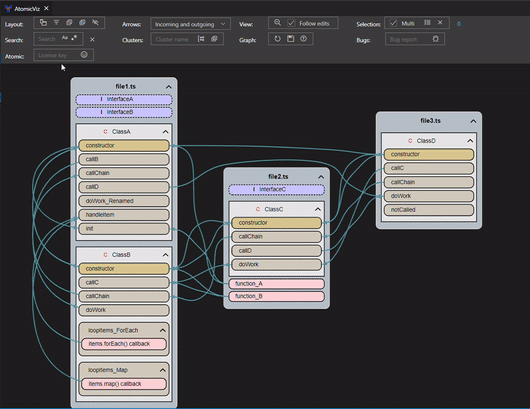

  

# AtomicViz

**AtomicViz** builds a visual map of your codebase, giving you a clearer understanding of its architecture, and making navigation easier.

* Select a set of files to generate an interactive code diagram
* Customize graphs to show only the classes and functions that are relevant to the task at hand
* Demo video: https://www.youtube.com/watch?v=ZsDd4Q4E81I

# Features

*  Create interactive graphs of:
  * Function calls
  * Variable references
  * Class inheritance
  * Interface implementation

*  Works for many programming languages
*  Interacts with the code:
    * Jump to code from the graph
    * Make the graph follow code editing

* Customize the graph:
    * Layout graphs by file/folder, by files, without any grouping, or using custom groups
    * Hide unwanted graph items that are not relevant to your focus
    * Collapse graph items to show class dependencies at any level of detail
    * Easily exclude specific files from the graph

* Save customized graphs as local files, and then click on a file to load the graph
* Show graphs in either the sidebar or code editor area
* Show multiple graphs simultaneously
* Search the graph
* Use the VS Code theme, light or dark
* Configure graph colors
* Export graphs as SVG

# Requirements

* Install the language pack for your language

# Paid features

* **AtomicViz** is free with limitations on the number and size of files included in the graph, and on the call-depth when graphing a function call hierarchy.

* You can purchase an **annual license** to remove these limitations for a single machine. Click the license link in the sidebar or the smiley face in the graph toolbar to purchase a license.

# How to use it

You can create several types of graphs:

1. **Files graph**: A graph based on a set of selected files which shows function calls, class inheritance, or interface implementation

2. **Function graph**: A graph which shows the call hierarchy of single function to a given call depth

Files identified in any **.gitignore** file in the project will be ignored when creating a graph.

* To **create a graph** for **selected files**:
  > In the file explorer select the folders or files to include in the graph, right-click and choose _**AtomicViz: Create graph for selected files**_ from the context menu.

* To **create a graph** for a **single function** to see its call hierarchy with a desired depth:
  > In the code, position the cursor on a function name, right-click and choose _**AtomicViz: Create graph for function**_ from the context menu. You can change the call depth later using the buttons in the toolbar.

* To **open an existing** graph file:
  > Click on the AtomicViz file (*.atm) in the file explorer. If the graph file is already open, then right-click on the file in the file explorer and choose _**AtomicViz: Show graph**_ from the context menu.

* To **add a file** to an existing "files" graph:
  > Open the file to add in the editor. Then right-click on the AtomicViz file in the file explorer and choose _**AtomicViz: Add active editor file to graph**_.

* To **convert**  a "function" graphto a "files" graph:
  > Right-click on the AtomicViz file in the file explorer and choose _**AtomicViz: Convert 'function' graph to 'files' graph**_ from the context menu.

# Graph interaction

* **Pan and zoom**
    * Pan by clicking and dragging the graph
    * Zoom in and out using the mouse wheel or a 2-finger motion on a trackpad. The focal point for zooming is the pointer location, not the center of the screen 
    * Reset zoom using the toolbar button: _**Zoom:Zoom out**_

* **Interact with the code**
    * Jump to code by double-clicking on a graph item
    * Make the graph follow code editing by checking the checkbox  _**View: Follow edits**_

* **Graph toolbar**
    * For a **Files graph**:
      * Choose whether to show function calls, class inheritance, or interface implementation
      * When showing "function calls", click the "variables button" to show variables and their references
        * Choose what type of variables to show
            * Class members
            * Global variables
            * Local variables
        * Arrows are shown for each reference to the variable within functions, excluding references in global scope
        * Use **Focus mode** to more clearly see the usage of the variable

    * For a **Function graph**, yyou can only choose the depth of the call hierarchy
    * Rebuild the graph after making code changes, by clicking the button _**Graph: Rebuild graph**_
        * If file or folder names have changed, you will be prompted about the missing files. If the graph is being loaded from an **AtomicViz** file, then you edit the graph file manually to fix the file paths

        * If the name of a class, function, or interface has changed, then the collapsed-state and hidden-state for that graph items will be lost. If the graph is being loaded from an **AtomicViz** file, then you edit the graph file manually to fix the names of classes, functions, or interfaces that should be hidden or collapsed.

    * Save the graph as an **AtomicViz** file or **export as SVG**. Note that **AtomicViz** graph files are usable only in the context of the workspace in which they are created.
    * Choose whether the graph **automatically follows** the cursor position in the editor. A newly focused graph item will be  highlighted in pink for a moment

* **Grouping toolbar**
    * Choose to group graph items by **file/folder**, by **file**, **without any grouping**, or using **custom groups**
    * When choosing to layout the graph by **files** or **without any grouping**, then you can create your own custom groups
    * Type a name for the group, select the top-level graph items to group, and then click the button _**Grouping: Create group**_
    * A top-level graph item can be included in just one group

* **Visibile toolbar**
    * Hide selected items. You can hide graph items that are not relevant to your focus or to the task at hand
    * **Hidden items** can be made visible again by clicking on the eye icon on a graph item), or using the toolbar button  _**Layout: Show hidden**_ to show top-level graph items that are hidden
    * Expand and collapse graph items to change the level of detail
        * **Collapse graph items**: classes or anonymous functions (or callbacks)
        * **Expand graph items**: classes or anonymous functions (or callbacks)
    * Use **Focus mode** to temporarily hide eveything else in the graph that is not connected to the selected item(s).
        * First select the item(s) to focus, then click the button  _**Visible: Focus selecte items**_
        * Click the focus button again to restore the graph to its unfocused state
    * You can expand the source and destination of an arrow by **double-clicking the arrow**. If the actual source or destination graph item is not visible (because its parent is collapsed), then the parent will be expanded to reveal the graph item

* **Layout toolbar**
    * Sort graph items by their file positions, or alternatively by the kind of item and alphabetically
    * Adjust the horizontal spacing between graph items to improve the graph layout

* **Zoom toolbar**
    * Check the checkbox  _**View: Follow edits**_ to make the graph follow edits to the code
    * Click the button _**Zoom:Zoom out**_ to reset the zoom level and make the entire graph visible

* **Selection toolbar**
    * Click a graph item to toggle its selection state
    * Selected items are shown with a yellow border
    * To select multiple graph items, check the checkbox _**"Selection: Multi"**_. By default, you can only select a single graph item. 
    * By default, selecting a graph item also **selects its children**. You can toggle the selected state of an item without **affecting its children** by holding down the _**Ctrl key**_ while clicking on the item
    * Clear all selections using the button _**Selection: Clear selection**_ or using the **Space Bar**
    * You can select a set of graph items using the button: _**Selection: Select items**_. Choose to select classes, interfaces, search result items, or graph items that are not connected to anything
    * When using multi-slection, a single edge can be both incoming and outgoing. Therefore, select a single graph item to clearly see its incoming and outgoing edges.
    * Clicking on an arrow will select it and hide all other arrows. To clear the arrow selection, click anywhere not on a graph item or edge. 

* **Arrows toolbar**
    * When nothing is selected, all arrows are shown by default
    * When graph item(s) are selected, choose whether to show both **incoming and outgoing** arrows, or just incoming, or just outgoing

* **Search toolbar**
    * Search for graph items by name. The items found will be highlighted in pink. You can then select those items using the selection menu _**Selection: Select items**_
    * Search supports options for case sensitivity and regular expressions.

* **Bugs toolbar**
    * Please report any bugs or ideas for improvement. You can also email me at atomicviz11@gmail.com

* **AtomicViz toolbar**
    * Click on the smiley face to **purchase an annual license** for the single machine you are using. Upon purchase, you will be **emailed the license key**.
    * Paste the **license key** into the text box and click the _**smiley face**_ button to activate the license.
    * Double-click the smiley face to remove an already activated license.

# Graph windows and colors
* Graphs can be shown in either the **sidebar** or code **editor area**. This is determined by the extension setting _**Show in sidebar**_
* Only a single sidebar graph can be open, but multiple graphs can be open simultaneously in the editor area
* Graphs use the **VS Code theme**, light or dark
* Graph colors for each type of graph item can be changed in the extension settings

# Data & Privacy

* Absolutely none of your code or environment data is collected or shared
* The extension runs completely locally except to manage licensing and to send telemetry for extension usage.

# Quick tutorials

#### Layout graphs by file/folder, by file, or without any grouping

#### Expand and collapse items using arrow icons

#### Expand and collapse item groups using toolbar

#### Hide unwanted items

#### Select item groups

#### Rebuild a graph after code changes

#### Create custom groups

# How does it work

* AtomicViz uses the **language server** capabilities of VS Code that are provided for each language. The language server can provide a call hierarchy for any function, so it is possible to build a map of a codebase by interrogating the language server for all the functions in a given scope.

* Graphs are created using **Graphviz**, so the layout is managed by the Graphviz algorithms.

* Transitions during the expansion or collapse of a graph item **try to maintain continuity of position** of the item affected. Generally, the top-right corner of an item should remain in position across a transition.

# Motivation

* Every codebase is a maze of files. The only semantic information at a quick glance are the file and folder names.

* A graphical representation of a code is more informative, and more useful as a tool for navigation if it shows only the files and functions relevant to the task at hand. Then you can easily jump to the sections of code that you are working on, without the need to use bookmarks, search-all-files for a symbol name, or find-all-references for a symbol.

# Keywords

* code architecture diagram
* code diagram
* code graph
* code navigation
* code visualizer
* code visualization
* dependency graph
* dependency diagram
* function call graph
* function call diagram
* function call hierarchy
* call hierarchy

# Troubleshooting

* **The extension isn't working for my language**

  Make sure your language is supported in VS Code. It should natively provide the ability to see the call hierarchy of a function, a capability usually installed as part of a language pack. You can check for this capability by right-clicking on the name of a function in your code, and see if there is a "**Show Call Hierarchy**" option in the context menu.

  

* **The graph is not created or there are no arrows between graph items**
  Sometimes the language server is not ready. AtomicViz will try to open one of the files in the graph to kickstart the language server, but sometimes it starts too slow. As a rememdy, first open any file in the language to be graphed **before** creating a graph or loading a graph file.

# Feedback

I would love to hear your feedback and ideas for improvements.
My email is atomicviz11@gmail.com

Thanks!

# Support

**AtomicViz** wasn't easy to build. If you find it useful, please consider supporting it.

# License
[Copyright](LICENSE.md) &copy; Brian DiLoreto 2024
